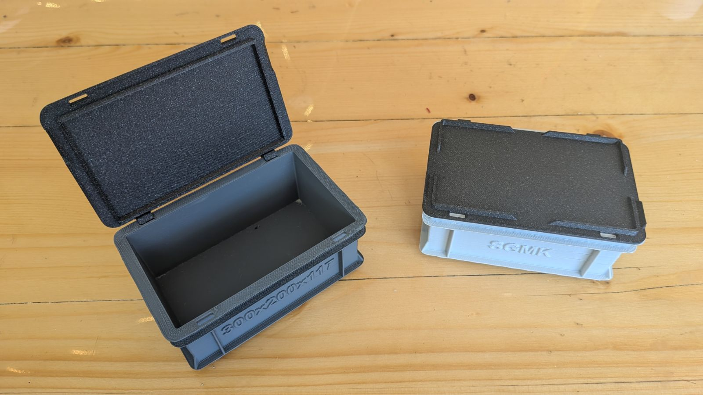
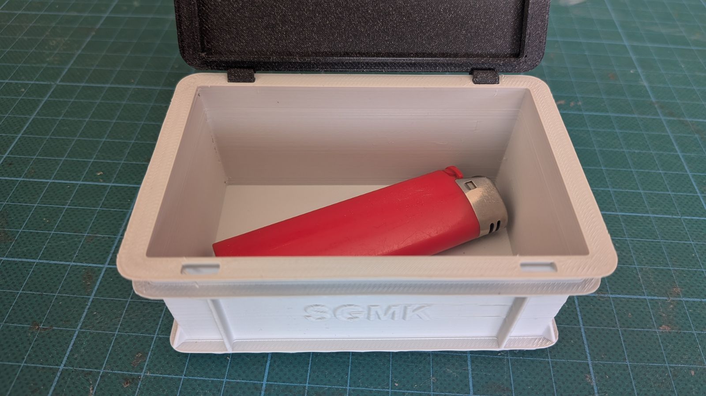
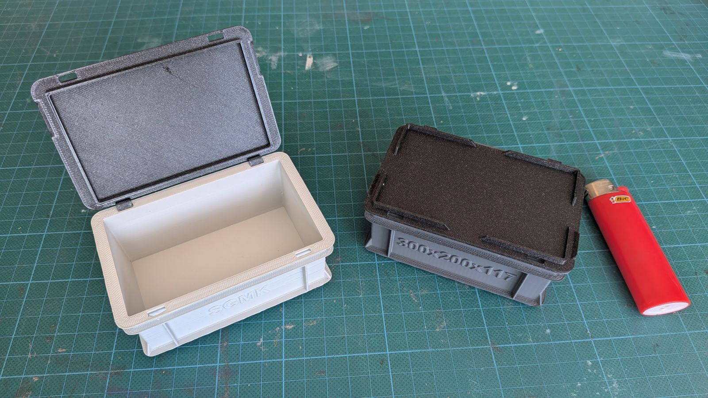
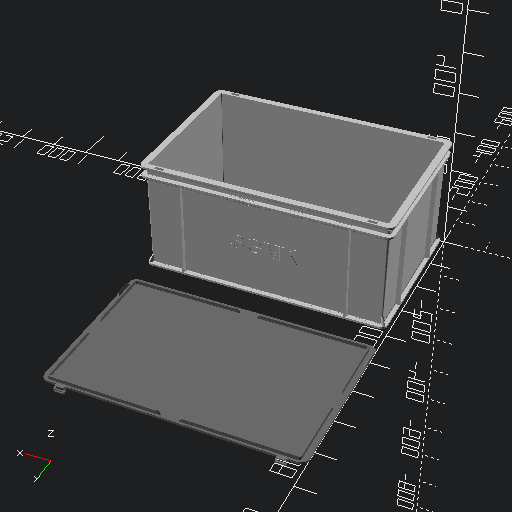

# Parametrized RAKO Box (Eurobox / Stapelbehälter)
A highly customizable, 3D-printable OpenSCAD model of the classic Utz RAKO Eurobox (Stapelbehälter).

This repository contains a fully parametric, printable model that mathematically replicates the complex draft-tapered geometry, structural rims, and stacking feet of a real RAKO box, allowing you to print custom storage solutions that perfectly interlock with industry standards.

## 📸 Gallery
### Real Prints

### OpenSCAD Customizer Renders
*(Large size presets shown with Snap-on Lids)*

## ✨ Features
* **Standard & Custom Sizes**: Use the built-in dropdowns to instantly select all standard Utz RAKO footprint sizes (200x150, 300x200, 400x300, 600x400, 800x600) and standard heights, or disable it to enter fully custom L x W x H bounds.
* **Mathematical Stacking**: The model automatically calculates wall thicknesses and dynamic inset steps to guarantee a perfect 1.0mm clearance stacking fit. The boxes will interlock tightly with each other and with real commercial Euroboxes.
* **Support-Free Printing**: The top rims feature parametric diagonal support triangles and massive corner gussets tuned to a standard 50° overhang, allowing you to print the complex upper structural flanges entirely without slicer supports.
* **Snap-Fit Lid & Hinges**: Optional snap-fit interlocking lids, including deep hinge slots on the back edge to attach C-hinges without losing the beautifully rounded corners.
* **Custom Embossing**: Easily emboss your own text labels onto the front and back long sides of the box using any font installed on your system.

## 🖨️ 3D Printing Tips
* **Support Triangles**: Real Utz RAKO boxes don't have small triangular supports under the top rim. However, because FDM 3D printers struggle with aggressive 90-degree overhangs, this parametric model introduces optional support triangles. Leave these enabled in the Customizer to allow the box to print cleanly without needing any slicer-generated support material!
* **Bottom Rim Supports**: While the top rims print support-free, it is highly recommended to enable standard slicer supports for the absolute bottom stacking foot/rim. These supports are very easy to remove and ensure the underside prints with perfect dimensional accuracy, guaranteeing the foot clicks cleanly inside the box below it when stacked.
* **Scaling the Model**: If you want to print miniaturized versions of the boxes, scaling the generated STLs down to **33%** in your slicer is the sweet spot. At 33%, the snap-fit hinges still function perfectly. You can scale them down to **25%** because they look incredibly cute, but be warned that the hinges will be at the absolute limit of their mechanical stability and may become too fragile!

## 🚀 Usage
1. Place both `rako_box_V4.scad` and the accompanying `rako_box_V4.json` presets file in the same folder.
2. Open the `.scad` file in **OpenSCAD**.
3. Ensure the Customizer is visible (View -> Customizer).
4. Use the dropdowns to configure your box, or select one of the pre-configured presets from the top dropdown (smallSize, midSize, largeSize).
5. Render (`F6`) and Export to STL!
