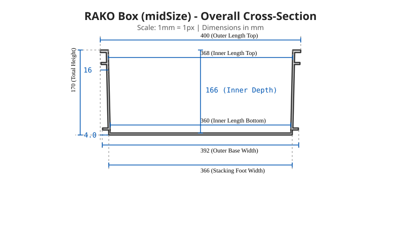
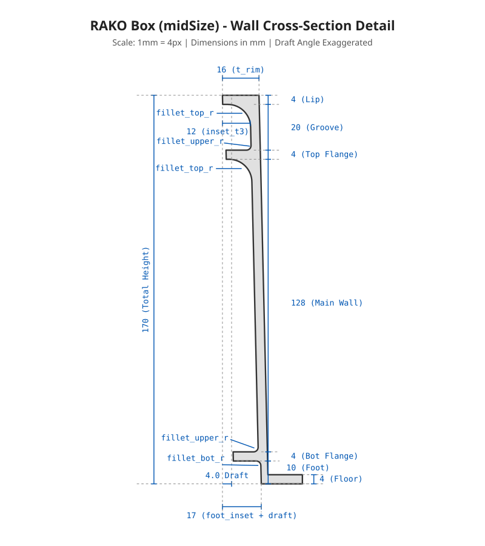
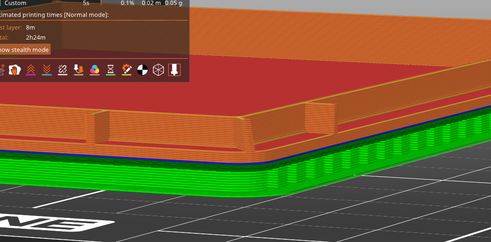
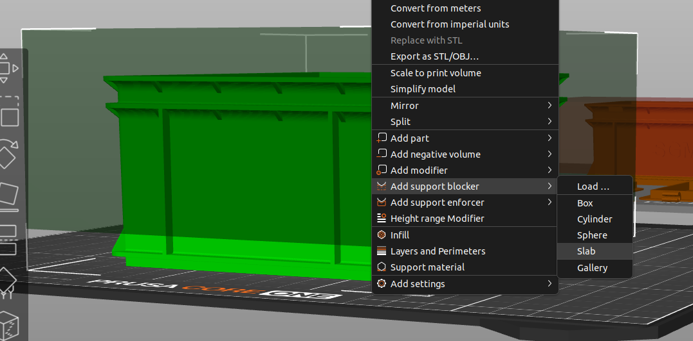

# Parametrized RAKO Box (Eurobox / Stapelbehälter)
A highly customizable, 3D-printable OpenSCAD model of the classic Utz RAKO Eurobox (Stapelbehälter).

This repository contains a fully parametric, printable model that mathematically replicates the complex draft-tapered geometry, structural rims, and stacking feet of a real RAKO box, allowing you to print custom storage solutions that perfectly interlock with industry standards.

## 📖 History of this Project
This project started as an experiment in human-AI collaboration during the [ddoS (das dreitägige odenwilusenz Sommerfest) event](https://ddos.odenwilusenz.ch/Hauptseite) late at night. The goal was to collaborate with an AI assistant to reverse-engineer and parametrically design a highly complex, 3D-printable replica of the classic Utz RAKO Eurobox.

Using a combination of reference photos, official Utz technical catalogs, and even audio messages to describe the intricate physical details (like the continuous draft taper, horizontal rims, and corner gussets), we iteratively refined the model. The entire geometry was coded from scratch in **OpenSCAD**, guided by continuous back-and-forth feedback with **Gemini AI**. Over the course of the night, we went from struggling with basic proportions to mathematically deriving a robust, parametric, support-free printing framework that accurately replicates the authentic industrial design.

## 📸 Gallery
### Real Prints


### Technical Drawings
*The structural complexity of the RAKO system is derived from its continuous draft taper and nested inset tiers. The outer shell, inner ribs, and bottom stacking foot each reside on precise inward-leaning planes to ensure immense rigidity while allowing identical boxes to interlock seamlessly with a perfect 1mm tolerance. Note that while this model replicates the authentic stacking geometry, the exact wall thicknesses and rib dimensions have been optimized for FDM 3D printing and structural stability, rather than being a 1:1 identical copy of the original injection-molded box.*

<p align="center">
  
  
</p>

### OpenSCAD Customizer Renders
*(Large size presets shown with Snap-on Lids)*


## 🆕 What's New in V5
* **Living-Hinge Snap Clips**: The lid now features flexible drop-down snap clips that mechanically lock into the existing side zip-tie holes of the box. The thickness of the clip dynamically calculates to fill the hole depth perfectly for a snug fit.
* **Independent Lid Thickness**: The lid plate thickness has been decoupled from the main wall thickness, allowing you to make much thicker, more robust lids without having to unnecessarily bulk up the box walls.
* **Refined Bash Exporting**: Included bash script now perfectly batch exports standard configurations, completely stripping OpenSCAD parameter overrides.

## ✨ Features
* **Standard & Custom Sizes**: Use the built-in dropdowns to instantly select all standard Utz RAKO footprint sizes (200x150, 300x200, 400x300, 600x400, 800x600) and standard heights, or disable it to enter fully custom L x W x H bounds.
* **Mathematical Stacking**: The model automatically calculates wall thicknesses and dynamic inset steps to guarantee a perfect 1.0mm clearance stacking fit. The boxes will interlock tightly with each other and with real commercial Euroboxes.
* **Support-Free Printing**: The top rims feature parametric diagonal support triangles and massive corner gussets tuned to a standard 50° overhang, allowing you to print the complex upper structural flanges entirely without slicer supports.
* **Snap-Fit Lid & Hinges**: Optional snap-fit interlocking lids, including deep hinge slots on the back edge to attach C-hinges without losing the beautifully rounded corners.
* **Custom Embossing**: Easily emboss your own text labels onto the front and back long sides of the box using any font installed on your system.

## 🖨️ 3D Printing Tips
* **Support Triangles**: Real Utz RAKO boxes don't have small triangular supports under the top rim. However, because FDM 3D printers struggle with aggressive 90-degree overhangs, this parametric model introduces optional support triangles. Leave these enabled in the Customizer to allow the box to print cleanly without needing any slicer-generated support material!
* **Bottom Rim Supports**: While the top rims print support-free, it is highly recommended to enable standard slicer supports for the absolute bottom stacking foot/rim. These supports are very easy to remove and ensure the underside prints with perfect dimensional accuracy, guaranteeing the foot clicks cleanly inside the box below it when stacked.

<p align="center">
  
  
</p>

* **Support Blockers**: To ensure your slicer only generates supports for the bottom rim and doesn't accidentally try to support the embossed text or the upper support-free rims, add a large support blocker volume (cube) covering the entire upper half of the box.

* **Scaling the Model**: The OpenSCAD design is scaled 1:1 to the exact size and proportions of commercial RAKO boxes. However, **we strongly advise against printing them at full scale!** Printing a full-size RAKO box is an immense waste of time, energy, and PLA—if you need a full-size box, it makes much more sense for the environment (and your wallet) to just buy a real injection-molded one! Instead, this model is meant to be scaled down in your slicer to create perfect miniature organizers. Scaling the generated STLs down to **33%** in your slicer is the sweet spot. At 33%, the snap-fit hinges still function perfectly. You can scale them down to **25%** because they look incredibly cute, but be warned that the hinges will be at the absolute limit of their mechanical stability and may become too fragile!

## 🚀 Usage
1. Place both `rako_box_V5.scad` and the accompanying `rako_box_V5.json` presets file in the same folder.
2. Open the `.scad` file in **OpenSCAD**.
3. Ensure the Customizer is visible (View -> Customizer).
4. Use the dropdowns to configure your box, or select one of the pre-configured presets from the top dropdown (smallSize, midSize, largeSize, BrushologyBox).
5. Render (`F6`) and Export to STL!

### Automated Exporting & Scaling
We have included a handy bash script (`export_stls.sh`) to automatically generate all STLs (the main boxes and the split lids) for the standard presets in one go.

To export everything at 1:1 full scale:
```bash
bash export_stls.sh
```

**Targeting a Single Preset:**
If you only want to export a specific preset, you can pass its name as the second argument (after the scale factor).
For example, to export only the `BrushologyBox` at 1:1 scale:
```bash
bash export_stls.sh 1.0 BrushologyBox
```

**Auto-Scaling for Miniatures:**
Because we strongly recommend printing miniatures, the script supports an optional scale parameter. It will automatically pass this to OpenSCAD and append the scale to the output filenames, so your 1:1 scale STLs are never accidentally overwritten!

For example, to export all presets pre-scaled to 33%:
```bash
bash export_stls.sh 0.33
```
Or to export *only* the `smallSize` preset at 50%:
```bash
bash export_stls.sh 0.5 smallSize
```
This will generate neatly named files like `STLs/smallSize/smallSize_V5_box_scale0.5.stl`.

*(Note: If you save a new custom preset in the Customizer (for example, named `myCustomBox`), you can simply run `bash export_stls.sh 1.0 myCustomBox` and the script will automatically export it for you!)*
